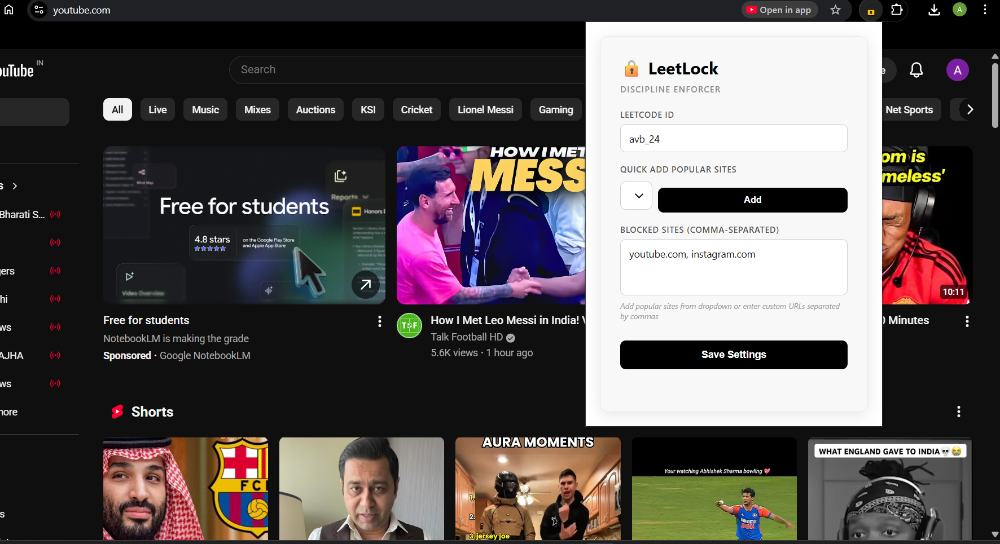
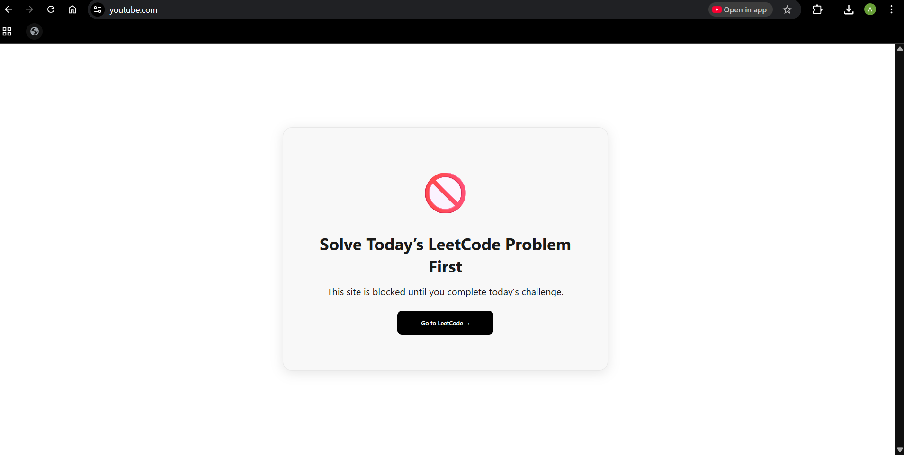

### Popup UI

### Blocked Website Page

# 🔒 LeetLock – LeetCode Discipline Enforcer

LeetLock is a **Chrome extension** that helps you stay consistent with daily coding by **blocking distracting websites** like YouTube and Instagram **until you solve the LeetCode Daily Challenge**.

If today’s problem is not solved, selected sites are blocked.  
Once solved, access is automatically restored.

---

## 🚀 Features

- 🔐 Blocks distracting websites until the daily LeetCode problem is solved
- 👤 Username-based verification (no LeetCode login required)
- 📡 Uses LeetCode’s public **GraphQL APIs**
- 🔁 Rechecks solve status when a blocked site is opened
- 🧩 Clean popup UI to configure:
  - LeetCode username
  - Websites to block
- 💾 Persistent data storage using `chrome.storage`
- ⚙️ Built using **Chrome Extension Manifest V3**

---

## 🧠 How It Works

1. User enters their **LeetCode username**
2. Extension fetches:
   - Today’s Daily Challenge problem
   - User’s recent accepted submissions
3. If today’s problem is **not found**:
   - Selected websites are blocked
4. Once the problem is solved:
   - Websites are automatically unblocked

---

## 🛠️ Tech Stack

- JavaScript (ES6+)
- Chrome Extension (Manifest V3)
- LeetCode GraphQL API
- HTML, CSS

---

## 📁 Project Structure

